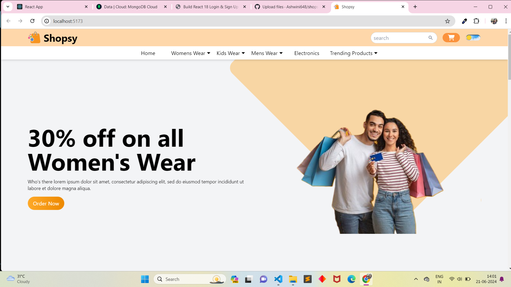

# React + Vite

This template provides a minimal setup to get React working in Vite with HMR and some ESLint rules.

Currently, two official plugins are available:

- [@vitejs/plugin-react](https://github.com/vitejs/vite-plugin-react/blob/main/packages/plugin-react/README.md) uses [Babel](https://babeljs.io/) for Fast Refresh
- [@vitejs/plugin-react-swc](https://github.com/vitejs/vite-plugin-react-swc) uses [SWC](https://swc.rs/) for Fast Refresh

<h1>Shopsys Ecommerce</h1>

Shopsys Platform is a fully functional e-commerce solution for businesses transitioning into tech companies with their own software development team. It contains the most common B2C and B2B features for online stores, and its infrastructure is prepared for high scalability.

Shopsys Platform is the fruit of our 16 years of experience in creating custom-made online stores, and it’s dedicated to the best in-house devs teams who work with online stores with tens of millions of Euros of turnover per year.

Our platform’s architecture is modern and corresponds to the latest trends in the production of software for leading e-commerce solutions. Deployment and scaling of our system are comfortable thanks to containerization and orchestration concepts (Docker, Kubernetes). The platform is based on one of the best PHP frameworks on the market - Symfony.

<h1>Shopsys Website</h1>

